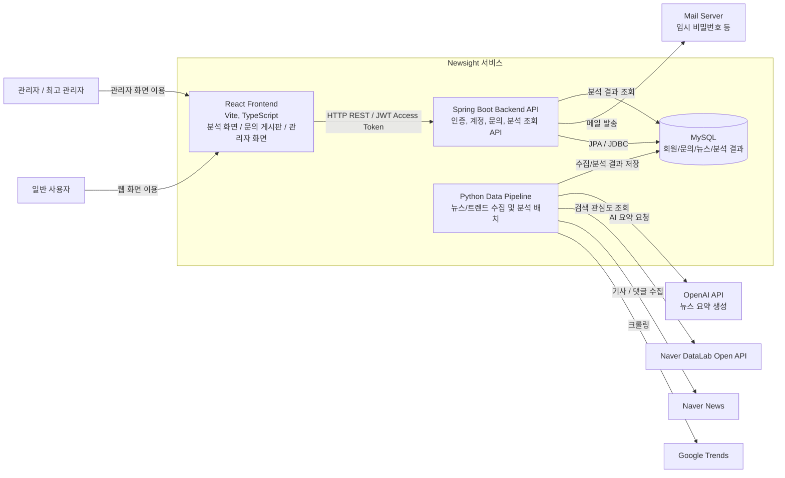
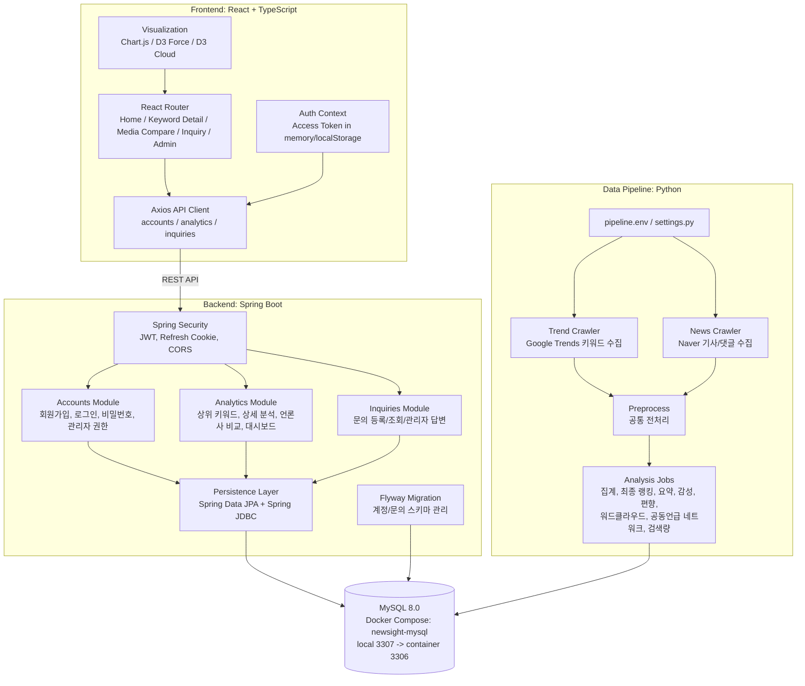
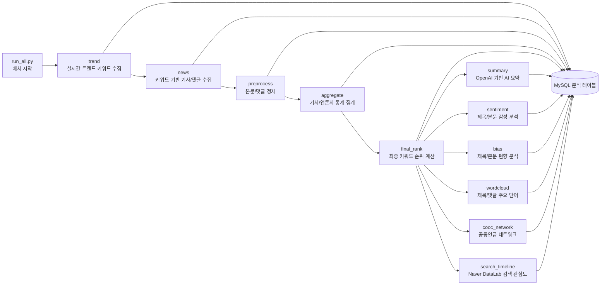
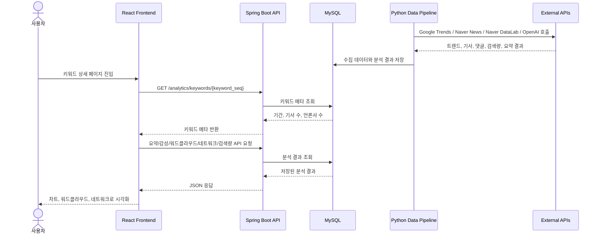
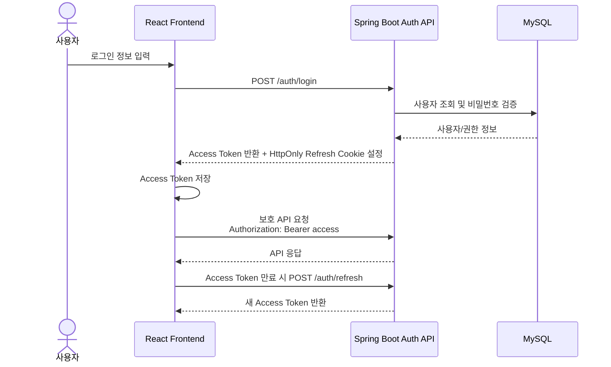

# Newsight Architecture Draft

이 문서는 현재 저장소 구조를 기준으로 작성한 아키텍처 그림 초안입니다.

## 1. System Context

## 2. Container / Component View

## 3. Data Pipeline Flow

## 4. Keyword Detail Sequence

## 5. Authentication Flow

## 6. Diagram Rules For This Project

- 큰 그림에서는 `Frontend`, `Backend API`, `Data Pipeline`, `MySQL`, `External APIs`만 보여준다.
- 상세 그림에서는 기능 단위를 `Accounts`, `Analytics`, `Inquiries`, `Pipeline Jobs`로 나눈다.
- 화살표에는 통신 방식이나 데이터 성격을 적는다: `REST API`, `JWT`, `JPA/JDBC`, `수집 데이터`, `분석 결과`.
- 외부 시스템은 서비스 바깥에 둔다: Google Trends, Naver News, Naver DataLab, OpenAI API, Mail Server.
- DB 테이블을 전부 한 장에 넣지 말고, 필요할 때만 계정/문의 테이블과 분석 테이블을 나누어 보인다.
- 발표용은 System Context 1장 + Data Pipeline Flow 1장 조합이 가장 무난하다.
- 구현 설명용은 Container / Component View와 Sequence Diagram을 함께 사용한다.

