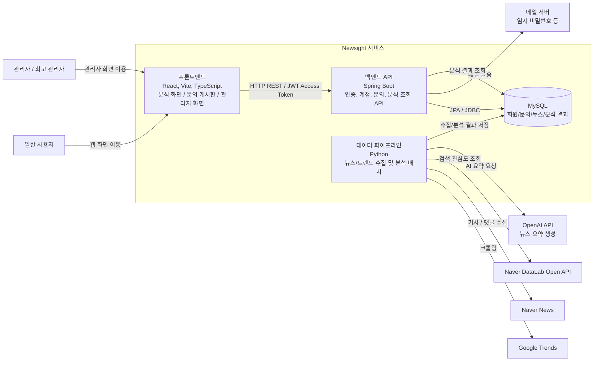
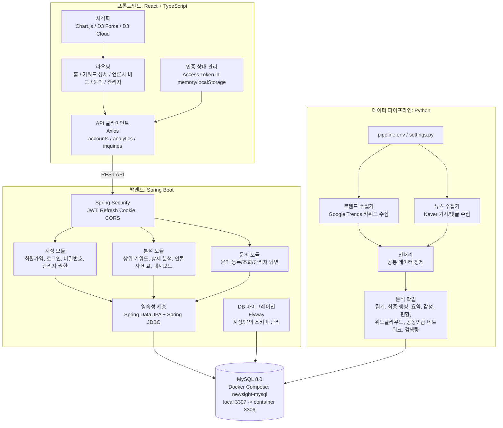
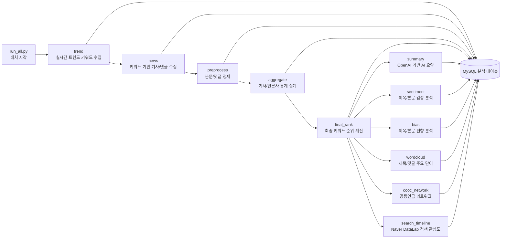
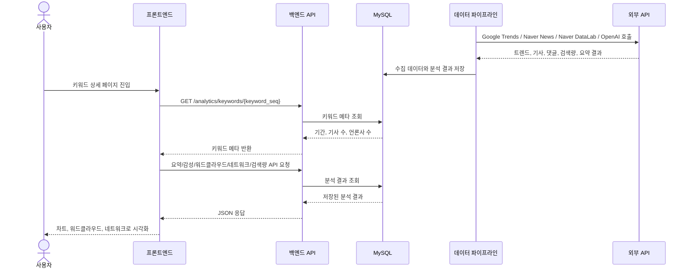

# Newsight 아키텍처 설계서

## 1. 시스템 전체 아키텍처

## 2. 컨테이너 및 컴포넌트 구조

## 3. 데이터 파이프라인 흐름

## 4. 키워드 상세 조회 흐름

## 5. 인증 흐름

## 6. 다이어그램 표기 기준

- 큰 그림에서는 `Frontend`, `Backend API`, `Data Pipeline`, `MySQL`, `External APIs`만 보여준다.
- 상세 그림에서는 기능 단위를 `Accounts`, `Analytics`, `Inquiries`, `Pipeline Jobs`로 나눈다.
- 화살표에는 통신 방식이나 데이터 성격을 적는다: `REST API`, `JWT`, `JPA/JDBC`, `수집 데이터`, `분석 결과`.
- 외부 시스템은 서비스 바깥에 둔다: Google Trends, Naver News, Naver DataLab, OpenAI API, Mail Server.
- DB는 계정/문의 데이터와 분석 데이터를 구분해서 표현한다.
- 발표 자료에서는 시스템 전체 아키텍처와 데이터 파이프라인 흐름을 중심으로 구성한다.
- 구현 설명에서는 컨테이너 및 컴포넌트 구조와 주요 기능 흐름을 함께 사용한다.
